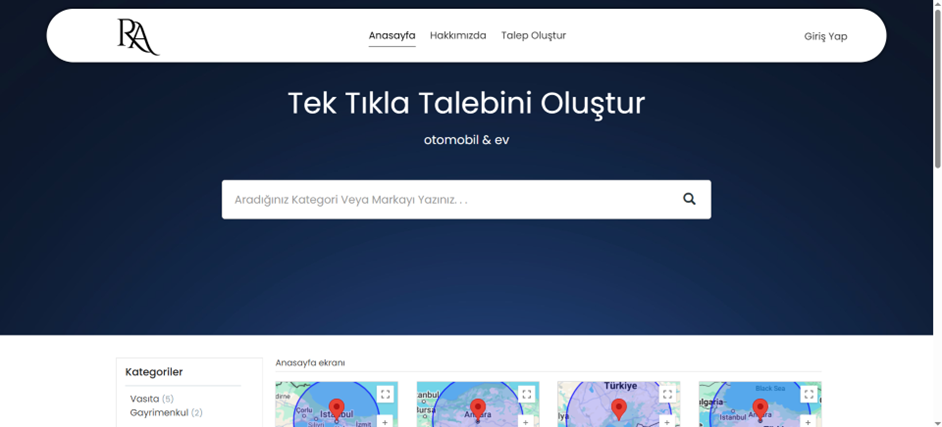

Bu tez çalışması, Tersine Açık Arttırma Sistemi adını taşıyan bitirme projesi olarak gerçekleştirilmiştir. 
Projenin tüm geliştirme süreçleri, Bilgisayar Mühendisliği Bölümü öğrencisi Mehmet Eren Ekiz tarafından yürütülmüştür.

Projede;

Web uygulamasının hem admin hem de kullanıcı tarafı geliştirilmiştir.

Frontend hazır bir şablon olarak alınmış ve birçok kısım ihtiyaçlara göre kapsamlı bir şekilde özelleştirilmiştir.

Backend tarafı baştan sona özgün olarak yazılmıştır.

Proje geliştirme sürecinde çeşitli çevrim içi kurslar ve dokümanlardan faydalanılmıştır.

Bu tez çalışması, vasıta arayan ve vasıta satan kullanıcılar için bir e-ticaret platformu geliştirmeyi amaçlamaktadır. Projede, talep tabanlı bir yaklaşım benimsenmiş olup, vasıta arayan kullanıcıların ihtiyaçlarına yönelik talepler oluşturmaları sağlanmaktadır. Bu taleplere karşılık olarak, vasıta satan kullanıcıların ilgili taleplere teklif verebilmesi mümkün kılınmıştır.

